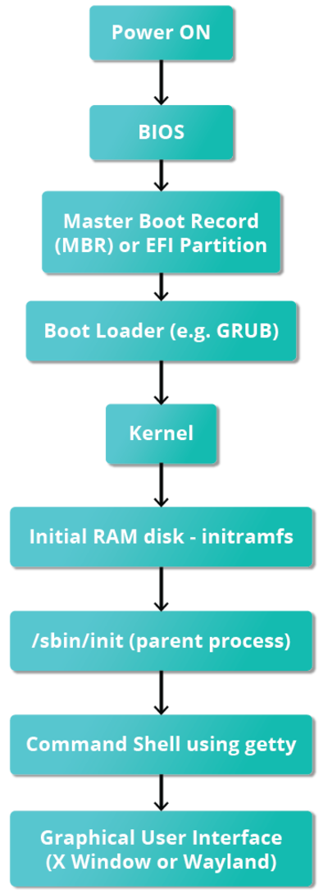
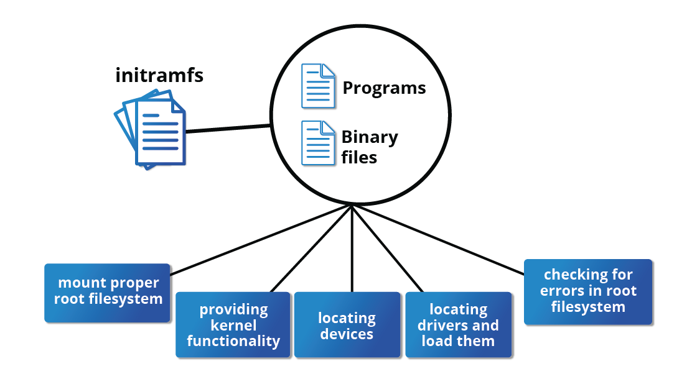

# The Boot Process
This refers to the procedure for initializing the system. It consists of everything that happens from when the computer is first switcher on until the user is fully operational. (The Linux Foundation)

Understanding the process is important in troubleshooting as well as customizing the system to optimize performance based on user needs. 

It is summarized in the image below

## BIOS
When the computer is turned on, Basic input/output system (BIOS) in older systems and Unified Extensible Firmware Interface (UEFI) in modern systems initializes the hardware. The BIOS software is store on a read-only memory (ROM) chip on the motherboard. 

It tests the initialized hardware (CPU, RAM, Keyboard, Storage). This process is known as POST (Power-On Self Test). It then identifies the bootdevice (disk, USB, network, etc.)

Control is then passed to the bootloader by reading the boot sector (Charles' notes)

**UEFI vs BIOS (ChatGPT)**
- UEFI uses EFI System Partition (ESP) and supports GPT disks.
- BIOS uses MBR disks and loads the first 512 bytes (the bootloader).

## Boot Loader Stage
### MBR 
#### BIOS/MBR Systems
The Master Boot Record (MBR) is the first sector of the bootable disk and contains the bootloader. The size of MBR is just 512 bytes.

The boot loader examines the **partition table** and finds a bootable partition. Once it finds a bootable partition, it searches for GRUB, the second-stage bootloader, and loads it into RAM.

MBR handles disk partitioning information and identifies where the operating system (OS) is located (Charles' notes)

#### EFI/UEFI Systems
For EFI/UEFI method, UEFI firmware reads its firmware to determine which disk and partition the EFI can be found. Once found, it launches the UEFI application, for example GRUB. 

*the procedure is more complicated but more versatile than the older MBR methods*

### GRUB
The GRand Unified Bootloader (GRUB) is a flexible bootloader that enables the user to choose the kernel to boot from.

The second stage boot loader resides under `/boot`. A splash screen is displayed, which allows us to choose which operating system (OS) and/or kernel to boot. 

After the OS is selected, the boot loader loads the kernel of the selected OS into memory (RAM) and passes control to it. It also passes any parameters or options specified in the boot configuration file.

## Kernel Initialization
Since kernels are almost always compressed, the first task is to uncompress itself. After this, it checks and analyzes system hardware and initializes and hardware drivers built into the kernel, and then mounts the root filestsystem.

The initramfs filesystem image contains programs and binary files that perform all actions needed to mount the proper root filesystem, including providing the kernel functionality required for the specific filesystem that will be used, and loading the device drivers for mass storage controllers, by taking advantage of the udev system (for user device), which is responsible for figuring out which devices are present, locating the device drivers they need to operate properly, and loading them. After the root filesystem has been found, it is checked for errors and mounted.

The mount program instructs the operating system that a filesystem is ready for use and associates it with a particular point in the overall hierarchy of the filesystem (the mount point). If this is successful, the initramfs is cleared from RAM, and the init program on the root filesystem (/sbin/init) is executed.

init handles the mounting and pivoting over to the final real root filesystem. If special hardware drivers are needed before the mass storage can be accessed, they must be in the initramfs image.

